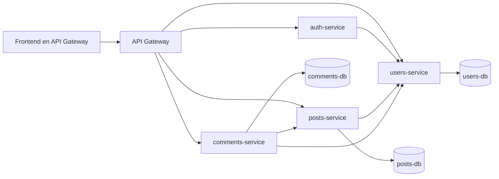
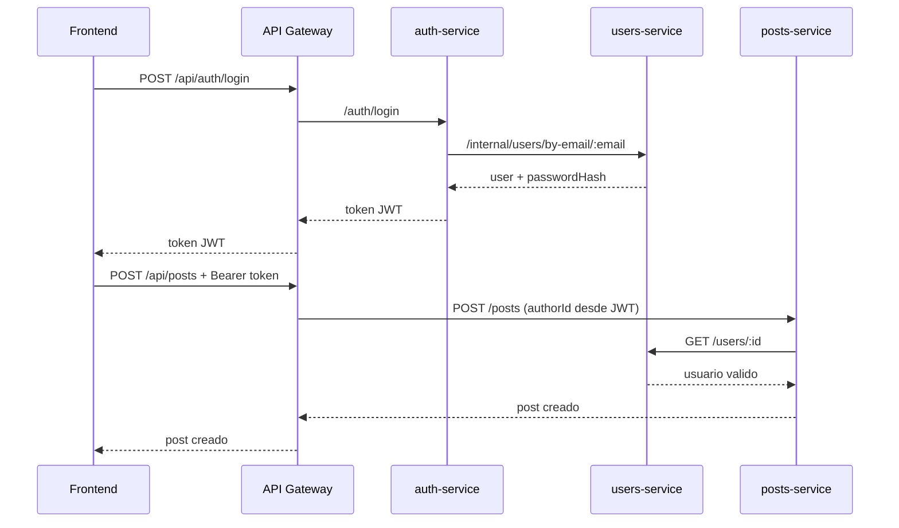

# Fase 2 - Diseno y arquitectura

## Microservicios definidos

1. `auth-service`
- Registro.
- Login.
- Emision y validacion de JWT.

2. `users-service`
- CRUD de usuario.
- Consulta interna por email para autenticacion.

3. `posts-service`
- CRUD de publicaciones.
- Validacion de autor consultando `users-service`.

4. `comments-service`
- Alta y eliminacion de comentarios.
- Validacion cruzada con `users-service` y `posts-service`.

5. `api-gateway`
- Punto unico de entrada.
- Middleware de autorizacion.
- Frontend integrado.

## Diseno de base de datos

### users-db

- `users(id, name, email, password_hash, role, bio, avatar_url, created_at, updated_at)`

### posts-db

- `posts(id, author_id, title, content, created_at, updated_at)`

### comments-db

- `comments(id, post_id, author_id, content, created_at)`

## Comunicacion entre servicios

- `auth-service` -> `users-service`: crear usuario y buscar por email.
- `posts-service` -> `users-service`: validar que el autor existe.
- `comments-service` -> `users-service`: validar autor.
- `comments-service` -> `posts-service`: validar que existe el post.
- `api-gateway` -> todos: enruta llamadas del frontend.

## Roles y autorizacion

- `reader`: acceso de lectura y comentarios.
- `author`: operaciones de escritura sobre sus publicaciones.
- `admin`: permisos globales y vista administrativa.
- El API Gateway valida JWT y aplica filtros de rol antes de enrutar.

## Diagrama de arquitectura (Mermaid)

## Diagrama de secuencia (login y publicar)

